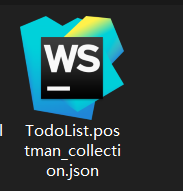
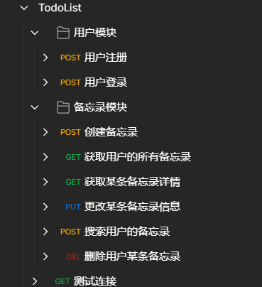

# 备忘录

**此项目使用`Gin`+`Gorm` ，基于`RESTful API`实现的一个备忘录**。


# 接口文档

启动项目后，直接访问 http://localhost:3000/swagger/index.html 

查看**swagger**文档

也可以选择postman文档导入

打开postman，点击导入


选择导入文件




效果




## 项目主要功能介绍

- 用户注册登录 ( jwt-go鉴权 )
- 新增/删除/修改/查询 备忘录
- 存储每条备忘录的浏览次数
- 分页功能


## 项目主要依赖：

**Golang V1.15**

- Gin
- Gorm
- mysql
- redis
- ini
- jwt-go
- logrus
- go-swagger

## 项目结构

```shell
TodoList/
├── api
├── cache
├── conf
├── middleware
├── model
├── pkg
│  ├── e
│  └──  util
├── routes
├── serializer
└── service
```

- api : 用于定义接口函数
- cache : 放置redis缓存
- conf : 用于存储配置文件
- middleware : 应用中间件
- model : 应用数据库模型
- pkg/e : 封装错误码
- pkg/logging : 日志打印
- pkg/util : 工具函数
- routes : 路由逻辑处理
- serializer : 将数据序列化为 json 的函数
- service : 接口函数的实现

## 配置文件
配置文件在conf/config.ini.example中，把.example去掉，然后根据自己的情况配置就好了

**conf/config.ini**
```ini
# debug开发模式,release生产模式
[service]
AppMode = debug
HttpPort = :3000
# 运行端口号 3000端口

[redis]
RedisDb = redis
RedisAddr = 
# redis ip地址和端口号
RedisPw = 
# redis 密码
RedisDbName = 2
# redis 名字

[mysql]
Db = mysql
DbHost =
# mysql ip地址
DbPort = 
# mysql 端口号
DbUser = 
# mysql 用户名
DbPassWord = 
# mysql 密码
DbName = 
# mysql 名字
```

## 简要说明
1. `mysql`是存储主要数据
2. `redis`用来存储备忘录的浏览次数

## 项目运行

**本项目使用`Go Mod`管理依赖。**

**下载依赖**

```shell
go mod tidy
```

**运行**

```shell
go run main.go
```

